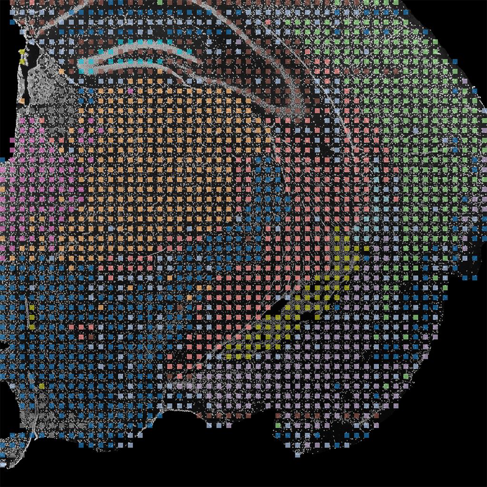

## DBiT-spatial-DARLIN

Version 0.2.0

This version only includes data quality control. And it can process data from three modalities. 

There are three modalities of data. We assume that you have such a data structure. 

```text
sample_name/
├── amplicon/
|   └── fastq/
|       ├── *_CA_R1.fq.gz
|       ├── *_CA_R2.fq.gz
|       ├── *_RA_R1.fq.gz
|       ├── *_RA_R2.fq.gz
|       ├── *_TA_R1.fq.gz
|       └── *_TA_R2.fq.gz
├── image/
|   └── your_iamge.tif
└── transcriptome/
    └── fastq/
        ├── *_R1.fq.gz
        └── *_R2.fq.gz
```

Script directory: `script`

Detailed technical documentation: [docs/TECHNICAL_DOCUMENTATION.md](docs/TECHNICAL_DOCUMENTATION.md)

There are four shell scripts in the Quality Control folder
1. `script/Quality_Control/dbit_mrna.sh` This script is used to process transcriptome data.
2. `script/Quality_Control/image.sh` This script is used to image segmentation and cell number prediction.
3. `script/Quality_Control/dbit_amplicon.sh` This script is used to process amplicon data.
4. `script/Quality_Control/plot_cell_filtered.sh` This script is used to plot after filtering out spots without cells.

## 1. Environment

Recommended: Python 3.10 for `image.sh`, Python 3.12 for others

We provide a Dockerfile and a Docker image (yuanwenxu/dbit:0.2.0). We also provide pixi.toml and pixi.lock.

## 2. Quick Start

You can find the startup command for each script here `script/Quality_Control/Startup_command.txt`.

You can use the following command to view the help documentation and understand the meaning of each parameter. 

```bash
bash script.sh -h
```

### Execution order
1. `script/Quality_Control/dbit_mrna.sh` This script will generate a `frame_umap.png`. Register this image onto the ssDNA staining image, then crop out the corresponding portion and name it `align.png`. 
2. `script/Quality_Control/image.sh` This script will segment `align.png` and predict the number of cells according to the predefined config.
3. `script/Quality_Control/dbit_amplicon.sh` This script is used to process the amplicon; it only needs to be completed before step four.
4. `script/Quality_Control/plot_cell_filtered.sh` Further processing of the data from the other two modalities was performed based on the cell number prediction results.

## 3. Output Directory Structure

This section displays the main results directory. You can find the results here. 

```text
sample_name/
├── amplicon/
|   └── results/
├── image/
|   └── filtered_results.csv
└── transcriptome/
    └── results/
```

Key results: Clustering results registered to brain slices
<p align="center">
    
<p>