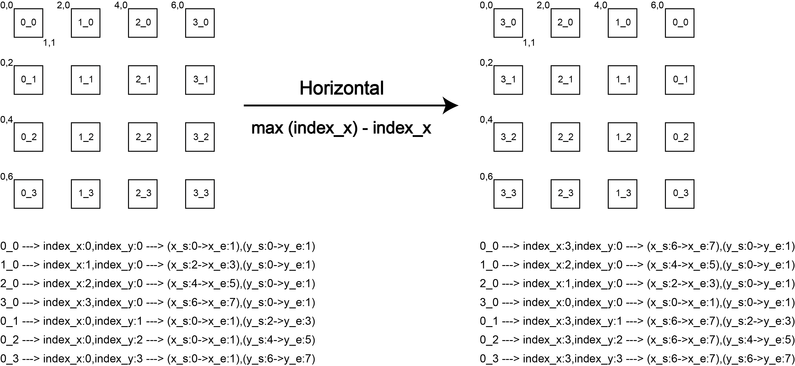
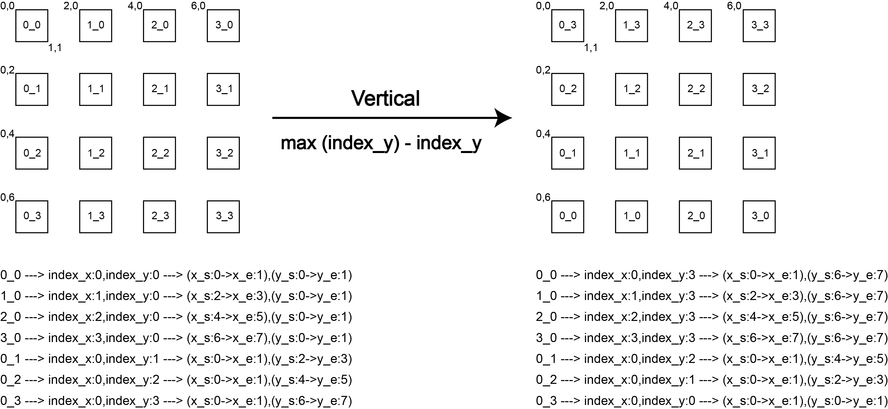
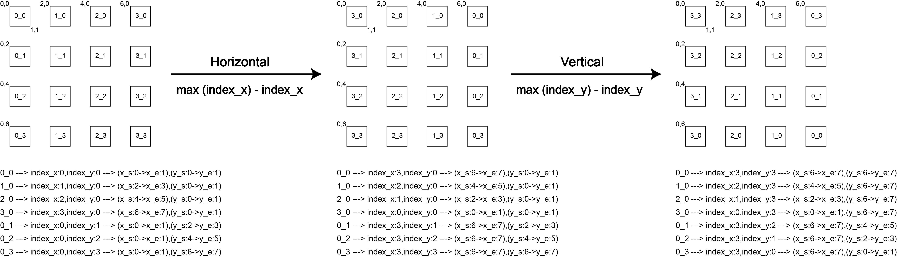
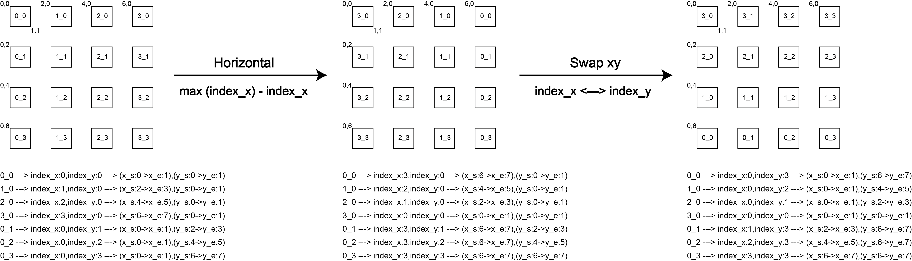
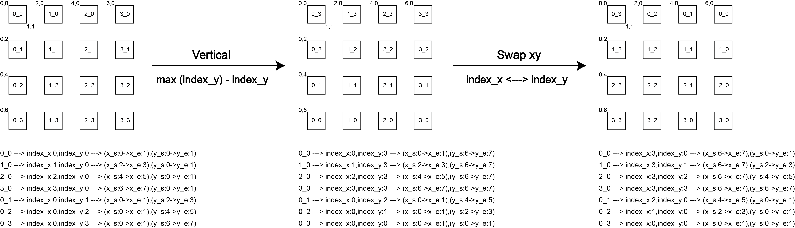

# Orientation Handling

This document explains the orientation parameters used by `image.sh` and `plot_cell_filtered.sh`, and how to choose the correct setting with the schematic images.

Current interface:

- `--orientation <mode>`: one of `normal`, `horizontal`, `vertical`, or `rotate`
- `--swap_xy`: swap the x/y coordinate axes after applying `--orientation`

These parameters are used when the image coordinate system, spatial barcode coordinate system, and final visualization direction do not match.

Important: use the long option `--orientation` in current commands. The short option `-o` is used as `--output_path` by `dbit_mrna.sh` and `dbit_amplicon.sh`, and it is not the orientation option in the current image-related interfaces.

## 1. Where Orientation Is Applied

### `image.sh`

`image.sh` splits `align.png` according to the spatial grid and names each tile as `x_y.tif`. The orientation parameters determine where spots such as `0_0`, `1_0`, and `0_1` are mapped on the original image.

Example:

```bash
bash script/Quality_Control/image.sh \
    -i /path/to/sample_name/image/align.png \
    -r /path/to/sample_name/image \
    --orientation horizontal
```

For a 90-degree direction adjustment, add `--swap_xy`:

```bash
bash script/Quality_Control/image.sh \
    -i /path/to/sample_name/image/align.png \
    -r /path/to/sample_name/image \
    --orientation vertical \
    --swap_xy
```

### `plot_cell_filtered.sh`

`plot_cell_filtered.sh` merges transcriptome/amplicon filtered plots onto `gray.png`. The orientation parameters determine how the filtered plots are flipped or rotated before merging, so that they align with `gray.png`.

Example:

```bash
bash script/Quality_Control/plot_cell_filtered.sh \
    -c /path/to/sample_name/image/filtered_results.csv \
    -m /path/to/sample_name/transcriptome/results/sample_name/Solo.out/GeneFull \
    -g /path/to/sample_name/image/gray.png \
    --orientation rotate
```

If `-g/--gray_path` is not provided, `plot_cell_filtered.sh` looks for `gray.png` in the same directory as `filtered_results.csv`.

## 2. Orientation Options

### `normal`

No orientation adjustment is applied. This assumes that the spatial coordinates and image direction already match.

Use this when:

- spot `0_0` is already in the expected position;
- the x and y coordinate directions match the displayed image;
- filtered plots align with `gray.png` without any transformation.

Command:

```bash
--orientation normal
```

### `horizontal`

Flip the coordinate system or overlay image horizontally.



Use this when:

- the left-right direction of the image is reversed relative to the spatial coordinates;
- spot `0_0` is on the opposite side in the horizontal direction;
- the overlay and `gray.png` show a left-right mirror mismatch.

Command:

```bash
--orientation horizontal
```

### `vertical`

Flip the coordinate system or overlay image vertically.



Use this when:

- the top-bottom direction of the image is reversed relative to the spatial coordinates;
- spot `0_0` is on the opposite side in the vertical direction;
- the overlay and `gray.png` show a top-bottom mirror mismatch.

Command:

```bash
--orientation vertical
```

### `rotate`

Rotate by 180 degrees. This is equivalent to applying both `horizontal` and `vertical`.



Use this when:

- both the left-right and top-bottom directions are reversed;
- spot `0_0` is located at the opposite corner;
- the overlay and `gray.png` differ by 180 degrees.

Command:

```bash
--orientation rotate
```

## 3. 90-Degree Rotation

90-degree rotation is handled by combining `--orientation` with `--swap_xy`. The `--swap_xy` option swaps the x/y coordinate axes after the orientation transformation.

### 90 Degrees Counterclockwise

Use `horizontal + --swap_xy`.



Command:

```bash
--orientation horizontal --swap_xy
```

Use this when:

- the image needs to be rotated 90 degrees counterclockwise relative to the spatial coordinates;
- the x/y axes are swapped and the origin position needs to be corrected by a horizontal flip.

### 90 Degrees Clockwise

Use `vertical + --swap_xy`.



Command:

```bash
--orientation vertical --swap_xy
```

Use this when:

- the image needs to be rotated 90 degrees clockwise relative to the spatial coordinates;
- the x/y axes are swapped and the origin position needs to be corrected by a vertical flip.

## 4. Quick Reference

| Required transformation | Parameters |
| --- | --- |
| No adjustment | `--orientation normal` |
| Flip left-right | `--orientation horizontal` |
| Flip top-bottom | `--orientation vertical` |
| Rotate 180 degrees | `--orientation rotate` |
| Rotate 90 degrees counterclockwise | `--orientation horizontal --swap_xy` |
| Rotate 90 degrees clockwise | `--orientation vertical --swap_xy` |

## 5. Recommended Check

1. Run `image.sh` first and inspect the generated `result.png`.
2. Check whether spot `0_0` in `result.png` is in the expected position.
3. If the spot labels are not oriented correctly, adjust `--orientation` and `--swap_xy` using the table above.
4. Run `plot_cell_filtered.sh` and check whether the generated `merged_*_filtered.png` files align with `gray.png`.

Use the same orientation parameters for `image.sh` and `plot_cell_filtered.sh` whenever possible. This keeps image splitting, cell filtering results, and final merged plots consistent.
